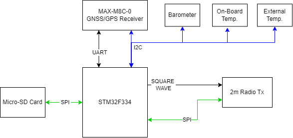
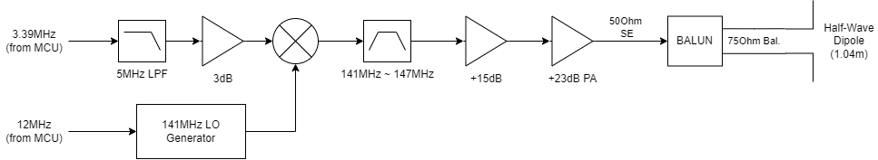

# High-Altitude Balloon Payload
These are the source files for my high-altitude balloon payload. The primary goals of the payload are:
* Make measurements and collect data: 
    * GPS Location
    * Barometric pressure (second determination of altitude)
    * Temperature.
* Telemeter the data via the Amatuer Radio 2m band (144.39MHz).
* Log the data to non-volatile storage.
* Powered from NiMH batteries.

The primary goal of the real-time telemetry is to be able to receive GPS coordinates so that we can track the balloon and hopefully chase it and find it more easily. The payload will also include a self-contained camera to take pictures. 

## Hardware Block Diagrams
### Logical Overview

### Power Architecture

### 2m Radio Transmitter
